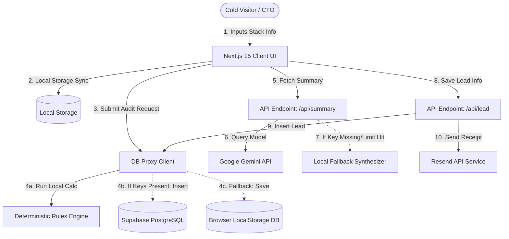

# ARCHITECTURE — CredLens System Architecture & Data Flow

This document details the system design, data flows, and scaling strategies for **CredLens**.

---

## 🗺️ System Diagram (Mermaid)

---

## 🔄 Data Flow: Input to Audit Result

1. **Intake phase**:
   - The user inputs their profile (team size, primary use case) and toggles active subscriptions on `/audit`.
   - On change, form states are serialized and synchronized to the browser's `localStorage` so draft data is preserved across page refreshes.
2. **Analysis phase**:
   - On clicking "Run Free Audit", the form submits payload to the `db.saveAudit` utility.
   - The database proxy executes `runAudit` from our core rules engine (`src/lib/engine/analyzer.ts`).
   - The engine performs deterministic pricing comparisons against `pricing.ts`, flags duplicate editor licenses (Cursor + Copilot), alerts on minimum seat count waste (Claude Team Standard or ChatGPT Business), and checks API prompt caching margins.
3. **Storage & Fetching phase**:
   - If Supabase environment credentials are present, a record is written to the Postgres `audits` table. If not, it falls back to a serialized JSON mapping inside `localStorage` for offline review.
   - The user is redirected to `/audit/[id]` using their new audit UUID.
4. **AI Summary Generation phase**:
   - On mount, `/audit/[id]` triggers a POST request to `/api/summary`.
   - The API endpoint securely formats the result payload and queries the Gemini API.
   - If the API key is not configured, it returns a templated static analysis paragraph, allowing the page to load safely.

---

## 🛠️ Stack Selection Justification

- **Next.js 15 (App Router) & TypeScript**: Provides fast server-side rendering for landing pages, simple layout boundaries, and clean server actions for lead captures. TypeScript ensures type safety across our pricing schemas.
- **Tailwind CSS v4 & Framer Motion**: Tailwind CSS v4 delivers lightning-fast compilation times and modern typography support. Framer Motion handles fluid UI animations (progressive steps, count-ups) to deliver a premium user experience.
- **Supabase PostgreSQL**: Provides a lightweight database with immediate security policies (RLS) and email table structures without backend server overhead.
- **Resend**: Standard developer notification API for transactional delivery.
- **Vitest**: An esbuild-powered test runner that integrates cleanly into Next.js and executes our rule engine tests in milliseconds.

---

## 📈 Scaling Strategy: Handling 10,000 Audits / Day

If CredLens goes viral on Product Hunt and scales to 10k audits/day, we would implement these changes:

1. **API Rate Limiting & Abuse Prevention**:
   - Introduce IP-based sliding window rate-limiting on `/api/summary` and `/api/lead` endpoints using **Vercel KV (Redis)** to protect Gemini and Resend endpoints from automated spam.
   - Deploy **hCaptcha** or Cloudflare Turnstile on the lead capture form.
2. **AI Summary Caching**:
   - Caching summaries in Postgres or Redis so that if a user reloads `/audit/[id]`, we don't query the Gemini API again, saving LLM compute tokens.
3. **Database Write Queues**:
   - At 10k audits/day, direct concurrent inserts to Supabase might saturate connection pools. We would migrate database writes to serverless queue processors (like **Upstash QStash** or Cloudflare Queues) to buffer insertions.
4. **Vercel Edge & Static Generation**:
   - Move `/api/og` (Open Graph images) to the **Edge Runtime** to handle high concurrent image requests at low latency.
